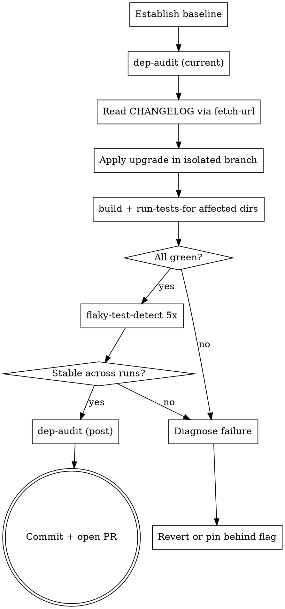

# Dependency Update Safety

## When to Use

- User asks to bump one or more deps to a newer version.
- A `dep-audit` run flags a known CVE you need to patch.
- A peer dep mismatch is blocking install / build.
- Quarterly dep-refresh chore.

**Don't use** for adding a brand-new dep (different workflow — it's
about evaluating fit, not upgrade compat).

## The Tools

| Tool | Used for |
|------|----------|
| `dep-audit` | Find known CVEs in current versions before/after upgrade |
| `docs-extract` | Get the dep's repo URL → CHANGELOG / migration guide |
| `fetch-url` | Read the actual changelog without the agent fabricating one |
| `web-search` | Find migration guides + community gotchas |
| `flaky-test-detect` | Run tests N× post-upgrade to spot flakes the upgrade introduced |
| `run-tests-for` | Run only the tests touching the upgraded dep |
| `diff-summary` | Confirm the upgrade diff is minimal before pushing |

## The Workflow



## Step 1 — Baseline

Always know **what works today** before changing anything:

```bash
git status -s    # confirm clean tree
bun run typecheck && bun test
bun script/agent-tools/dep-audit.ts > /tmp/audit-before.txt
```

If anything fails BEFORE the upgrade, fix that first. You can't tell
which failures the upgrade introduced if there's pre-existing red.

## Step 2 — Read the Changelog

Don't trust the LLM (you) to summarize a changelog from training data —
versions newer than the cutoff don't exist there:

```bash
bun script/agent-tools/docs-extract.ts --filter <pkg>
# → 🔗 https://github.com/owner/pkg
bun script/agent-tools/fetch-url.ts \
  https://github.com/owner/pkg/blob/main/CHANGELOG.md \
  --max-bytes=64000
```

Look for:

- **Breaking changes** between current and target version (often listed
  with ⚠️ / `BREAKING:` / `[breaking]` markers).
- **Migration scripts** (`pkg-codemod`, `npx pkg migrate`).
- **Removed APIs** that the codebase still imports.
- **Peer-dep changes** — bumping peer-dep ranges can cascade into 3
  other upgrades.

## Step 3 — Isolate the Branch

```bash
git switch -c chore/upgrade-<pkg>-vX.Y
```

One PR = one cluster of related upgrades. Don't bundle React + Vite +
TypeScript bumps together; if anything breaks you can't bisect.

## Step 4 — Apply Upgrade

```bash
# Pick the right command for your package manager:
bun add <pkg>@<version>          # Bun
pnpm up <pkg>@<version>          # pnpm
npm i <pkg>@<version>            # npm
cargo update -p <crate>          # Rust
go get <pkg>@<version>           # Go
```

Then **immediately**:

```bash
bun run typecheck  # catches API removals at compile time
```

If typecheck fails, the changelog should have warned you. Fix the call
sites before going further.

## Step 5 — Targeted Tests

Don't run the whole test suite first — narrow to what touches the dep:

```bash
# Files that import the upgraded package
grep -rn "from ['\"]<pkg>" packages/ src/ \
  | cut -d: -f1 | sort -u > /tmp/affected.txt

# Run their tests
bun script/agent-tools/run-tests-for.ts $(cat /tmp/affected.txt)
```

Wider sweep only after the targeted tests pass.

## Step 6 — Flaky Detection

Some upgrades introduce subtle race conditions or timing changes that
appear as intermittent failures. Run 5× to catch them:

```bash
bun script/agent-tools/flaky-test-detect.ts -n 5 --filter "<pkg>"
```

A test that flips pass/fail across runs is a flake — likely the
upgrade. Investigate before merging.

## Step 7 — Re-audit + PR

```bash
bun script/agent-tools/dep-audit.ts > /tmp/audit-after.txt
diff /tmp/audit-before.txt /tmp/audit-after.txt
```

The diff should show **fewer** vulnerabilities (the whole point) or
zero net change (cosmetic upgrade). If it shows MORE, the upgrade
introduced new advisories — read them and decide.

PR description must include:

- Old → new version
- Link to changelog (the URL fetch-url returned)
- One-line summary of breaking changes encountered + how you handled them
- Test plan (which tests, how many runs)
- The audit before/after diff

## Anti-patterns

| Don't | Why |
|-------|-----|
| Bundle multiple unrelated upgrades | Can't bisect when something breaks. |
| Skip the baseline | You won't know what was already broken. |
| Trust your training data on what changed | Versions ≥ cutoff don't exist in your weights. |
| Upgrade peer deps in same PR | Even harder to bisect; merge them in serially. |
| Force-push a passing build to main | If a flake appears later, you have no rollback target. |
| Ignore deprecation warnings ("they still work") | They're the next breaking change in disguise. |

## When to Pin Behind a Flag

If the upgrade is **necessary** (security) but **risky** (major version
jump, big breaking diff), stage it:

1. Land the upgrade with the new behavior gated behind a feature flag.
2. Default the flag to `false` (old behavior).
3. Enable in CI / staging first, monitor for ≥1 week.
4. Flip default to `true`. Remove the flag the release after.

This converts "Monday surprise" into a controlled rollout.

## Examples

### Example 1 — Bump React 18 → 19

```bash
# Baseline
bun run typecheck && bun test

# Read the migration guide
bun script/agent-tools/fetch-url.ts \
  https://react.dev/blog/2024/12/05/react-19

# Apply
bun add react@^19 react-dom@^19 @types/react@^19 @types/react-dom@^19

# Typecheck — catches removed APIs
bun run typecheck
# … fix call sites if anything failed

# Targeted tests
bun script/agent-tools/run-tests-for.ts $(grep -rln 'from "react"' src/ | tr '\n' ' ')

# Stability
bun script/agent-tools/flaky-test-detect.ts -n 5

# Re-audit
bun script/agent-tools/dep-audit.ts --severity=moderate
```

### Example 2 — Patch a CVE

```bash
bun script/agent-tools/dep-audit.ts --severity=high
# 🔴 CRITICAL  some-pkg@1.2.3  → fixed in: 1.2.5

bun add some-pkg@^1.2.5
bun run typecheck && bun test
bun script/agent-tools/dep-audit.ts --severity=high
# ✅ No vulnerabilities found
```
