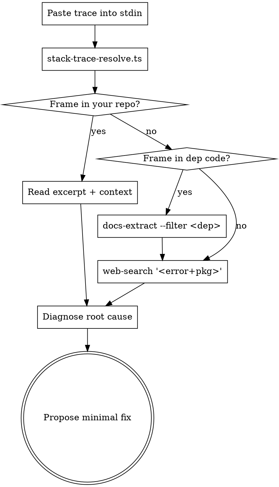

# Stack Trace Triage

## When to Use

- User pastes a stack trace from production / CI / a bug report.
- A `bun run` / `npm test` / `cargo test` run errored and you have a
  trace in scrollback.
- An issue tracker links a trace and you need to act on it.

**Don't use** for compiler/lint errors (those need `find-symbol` +
Grep — they're not runtime).

## The Workflow



## Step 1 — Run the Resolver

```bash
echo "$trace" | bun script/agent-tools/stack-trace-resolve.ts
# or
bun script/agent-tools/stack-trace-resolve.ts < trace.txt
```

The output is per-frame:

```
#0 functionName  →  src/foo.ts:42:13
     resolved: /abs/path/src/foo.ts
        40 |   const data = ...
        41 |   process(data)
    >>> 42 |   throw new TypeError(...)
        43 |   return ok
        44 | }
```

The `>>>` line is the call site. Read up 5-10 lines for the actual
state at throw time.

## Step 2 — Identify the Frame Type

Each frame falls into one of three buckets:

| Bucket | Sign | What to do |
|--------|------|------------|
| **Your code** | path under repo + your function name | Read excerpt, fix locally |
| **Dependency** | path under `node_modules` / `~/.cargo` etc. | Don't fix the dep — fix the call site |
| **Runtime / framework** | `internal/` Node, JIT frames, etc. | Almost always a misuse upstream — look one frame down |

The first frame in **your code** (often the second or third in the trace)
is usually the actual root cause; deeper frames are dependencies just
doing what your code asked.

## Step 3 — Read the Excerpt

The auto-printed ±2 line excerpt is enough for ~70% of bugs. Common
patterns to spot:

- **Off-by-one / null deref**: `arr[i]` where `i` could exceed length;
  `obj.foo.bar` where `obj.foo` is sometimes undefined.
- **Async race**: `await` missing on a promise; cleanup before await
  resolves.
- **Wrong API shape**: passing an array where the dep wants a Set; passing
  a Promise where it wants a value.
- **Type-erased generics**: TS doesn't catch it because the input was
  `any` somewhere upstream.

If 5 lines isn't enough, re-run with `--context 10`.

## Step 4 — When the Frame is in a Dependency

Don't patch the dep. Patch the **call site** in your code that's
feeding it the bad input. The dep code is rarely the bug — it's
defending itself with an assertion that you tripped.

Tools to figure out what your code is supposed to pass:

```bash
# Get the dep's docs URL fast
bun script/agent-tools/docs-extract.ts --filter <pkg-name>

# Search for "<error message> <pkg>"
bun script/agent-tools/web-search.ts \
  '"useMenuItemContext must be used within a Menu.Item" kobalte'

# Read the dep's GitHub issues for this exact error
bun script/agent-tools/web-search.ts \
  --site=github.com 'kobalte useMenuItemContext'
```

If the search returns a known issue + fix, prefer that fix over your
own — community solutions tend to handle edge cases.

## Step 5 — Propose a Minimal Fix

Once you know the root cause:

- **Touch as few files as possible.** Big diffs are hard to review and
  often introduce new regressions.
- **Add a regression test** _before_ the fix when possible — proves the
  bug + locks it in once fixed.
- **Don't refactor** in the same change. Even if the surrounding code
  is ugly, fix the bug first; refactor later when reviewers can see the
  intent without the bug-fix noise.

## Anti-patterns

| Don't | Why |
|-------|-----|
| Read the trace top-to-bottom | The interesting frame is rarely #0; jump to the first one in your code. |
| Patch the deepest frame (the dep) | The bug is at the call site; deps just defend themselves. |
| Add try/catch to silence the throw | Hides the bug, surfaces later as a state corruption. |
| Skip reading the excerpt | The fix is usually obvious once you see ±5 lines. |
| Search the error message verbatim with no quotes | Search engines tokenize; quote it. |
| Trust the first SO answer | Cross-check with the dep's official docs / issues. |

## Examples

### Example 1 — Renderer crash

```
TypeError: Cannot read properties of undefined (reading 'name')
    at FileVisual (src/components/session/session-sortable-tab.tsx:25:43)
    at SortableTab (src/components/session/session-sortable-tab.tsx:36:34)
```

```bash
bun script/agent-tools/stack-trace-resolve.ts <<EOF
TypeError: Cannot read properties of undefined (reading 'name')
    at FileVisual (src/components/session/session-sortable-tab.tsx:25:43)
EOF
```

Excerpt shows `node.name` — but `node` is `props.path: string`, not a
node object. Fix: use `getFilename(props.path)` instead. Two-line diff,
no refactor.

### Example 2 — Library misuse

```
[kobalte]: useMenuItemContext must be used within a Menu.Item component
    at MenuItemLabel (...kobalte.../menu-item-label.js:10:11)
    at ContextMenuItemLabel (.../context-menu.tsx:160:5)
    at .../session-sortable-tab.tsx:155
```

Frame #2 is in our code (`session-sortable-tab.tsx:155`). Excerpt shows:

```tsx
<ContextMenu.SubTrigger>
  <ContextMenu.ItemLabel>{t("editor.menu.openIn")}</ContextMenu.ItemLabel>
</ContextMenu.SubTrigger>
```

`SubTrigger` isn't a `Menu.Item` — that's the message. Fix: pass the
label as plain children. One-line diff.
