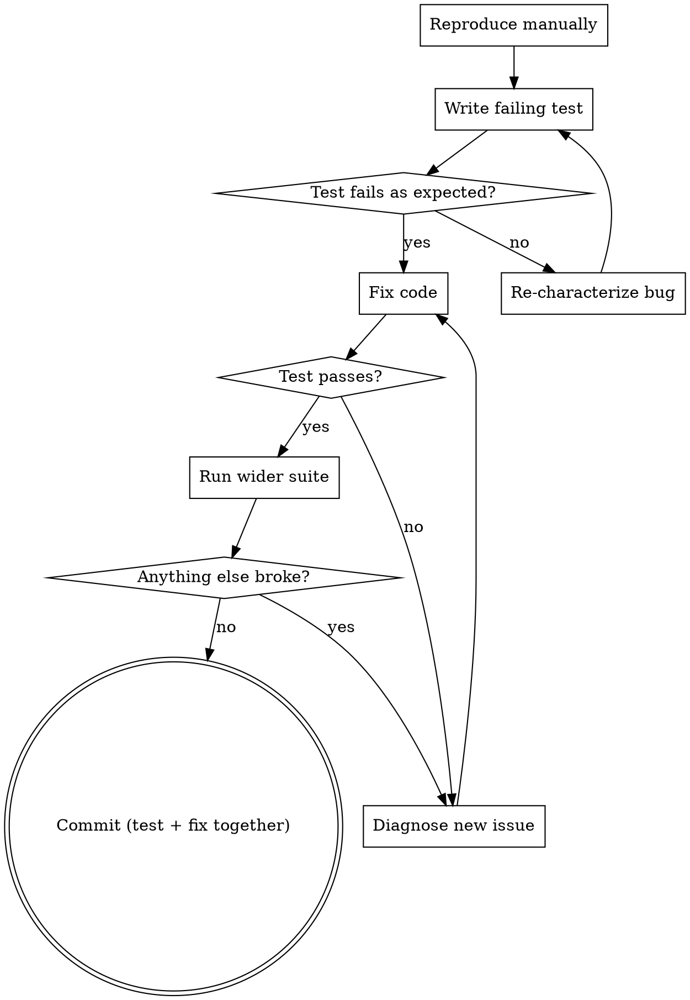

# Test-Driven Debugging

## When to Use

- A bug is reported (issue, user diagnostic, stack trace) and you need
  to fix it for real, not just patch the symptom.
- A flaky test surfaced and you need to determine if it's a real bug
  or a test problem.
- You're making a behaviour change in code that doesn't have direct
  test coverage and you want to add some on the way in.

**Don't use** for purely cosmetic changes (formatting, comments,
typos). Don't use for one-off scripts that won't be re-run.

## The Discipline

The hard rule: **the test goes in BEFORE the fix and must initially
fail**. If your test passes against the buggy code, you've tested the
wrong thing — back to characterizing the bug.



## The Process

### 1. Reproduce manually first

Before writing a test, reproduce the bug in the running app, in a REPL,
or via a curl. If you can't reproduce it, you can't write a test for
it — and "fixing" it is gambling.

If reproduction is hard:

- For a stack trace from production: use `stack-trace-resolve` to
  pinpoint the file/line, read ±10 lines, and form a hypothesis about
  inputs that trigger it.
- For a flaky test: use `flaky-test-detect -n 20` to get a stable
  failure rate; ≥ 30% means you can probably reproduce in <5 retries.

### 2. Write the failing test

Pick the smallest test surface that exercises the bug:

- **Unit** when the bug is contained to one function/class.
- **Integration** when the bug is at a boundary (DB, HTTP, IPC).
- **E2E** only when the bug emerges from interaction across all
  layers — and even then, prefer a regression-test integration test.

Test name should describe the bug, not the implementation:

✅ `it("preserves comment formatting when applying patch")`
❌ `it("works with patch.apply()")`

### 3. Run ONLY this test

Don't run the suite yet — you're characterizing one thing:

```bash
bun script/agent-tools/run-tests-for.ts path/to/the.test.ts
# or
bun test path/to/the.test.ts -t "regression name"
```

The test MUST fail. If it passes, your test is not exercising the bug
— go back to step 1, paying closer attention to inputs.

### 4. Fix the code

Now and only now is the fix allowed. Constraints:

- **Touch only the file(s) needed** for the test to pass. Don't
  refactor in the same change.
- **No `try/catch` to swallow the symptom**. Find the actual
  predicate that's wrong.
- **Comment why** if the fix is non-obvious. Future you will thank you.

### 5. Verify

- Targeted test passes.
- Wider suite passes:
  ```bash
  bun script/agent-tools/run-tests-for.ts <files-you-changed>
  ```
- Flake check, in case the fix is timing-sensitive:
  ```bash
  bun script/agent-tools/flaky-test-detect.ts -n 5 --filter "<your test name>"
  ```

### 6. Commit

The test and the fix go in the **same commit**. This is non-negotiable:

- Future bisect lands on a commit that's still reasonable (test + fix
  together, never test-without-fix or fix-without-test).
- Code review can see "this is what was wrong" right next to "this is
  what fixed it".
- Reverting the commit reverts both, so a botched fix doesn't leave a
  test pinning broken behaviour.

Commit message format:

```
fix(<scope>): <one-line>

<paragraph: what the bug was, what triggered it, why the fix works>

Closes #<issue>.
```

## Anti-patterns

| Don't | Why |
|-------|-----|
| Skip the failing-test step "because the fix is obvious" | Then you'll skip it next time too, and one day the bug is back and there's no test to catch it. |
| Test the implementation ("calls this function with these args") | Brittle — refactors break the test even when behaviour is preserved. Test behaviour. |
| `try/catch` to swallow the throw | Hides the real bug. The next caller hits a corrupted state. |
| Test passes immediately on the buggy code | You're testing the wrong thing. Reproduce harder. |
| Refactor + fix in the same commit | Reviewer can't tell the fix from the refactor. Two commits. |
| Add the test in a separate later commit | Bisect lands on the broken middle. Test + fix together. |
| Loosen an existing test to make new code pass | The existing test caught a real concern. Resolve the conflict, don't paper over it. |

## Worked Examples

### Example 1 — Stack-trace driven

> Diagnostic shows: `TypeError: Cannot read properties of undefined (reading 'name')`
> at `FileVisual (src/components/session/session-sortable-tab.tsx:25:43)`

```bash
# 1. Resolve to source
echo "$trace" | bun script/agent-tools/stack-trace-resolve.ts
# Source excerpt shows: <span>{node.name}</span>  but the prop is path: string, not a node.

# 2. Failing test FIRST
cat > src/components/session/session-sortable-tab.test.tsx << 'EOF'
test("FileVisual renders the basename of a string path", () => {
  const { getByText } = render(<FileVisual path="src/foo/bar.ts" />)
  expect(getByText("bar.ts")).toBeInTheDocument()
})
EOF

bun test src/components/session/session-sortable-tab.test.tsx
# → fail: TypeError: Cannot read properties of undefined (reading 'name')

# 3. Fix:
# - <span>{node.name}</span>
# + <span>{getFilename(props.path)}</span>

# 4. Verify
bun test src/components/session/session-sortable-tab.test.tsx
# → pass

# 5. Commit
git add src/components/session/session-sortable-tab.tsx \
        src/components/session/session-sortable-tab.test.tsx
git commit -m "fix(ide): FileVisual reads basename from path prop, not node.name"
```

### Example 2 — Flake-driven

> CI flake: `it("syncs events end-to-end")` fails 1 in 8 runs.

```bash
# 1. Confirm the flake locally
bun script/agent-tools/flaky-test-detect.ts -n 20 --filter "syncs events end-to-end"
# → 17 P / 3 F  → flaky, not broken

# 2. Read the test + add timing to the failure mode.
#    Hypothesis: race between push debounce (5s) + assertion (no wait).

# 3. Failing test that DETERMINISTICALLY fails:
test("syncs events end-to-end (no implicit waits)", async () => {
  await pushOne()
  // No wait → race against the 5s debounce → fail in race losers.
  expect(await pulledCount()).toBe(1)
})

# 4. Fix: await the debounce explicitly. Make the prod code testable
#    by exposing a flush() that fires the pending debounce now.

# 5. Verify, including 20× re-run.
```

## Related skills

- **stack-trace-triage** — produce the failing test from a trace.
- **pre-commit-review** — run secret-scan + tests before commit.
- **verification-before-completion** — final E2E check.
