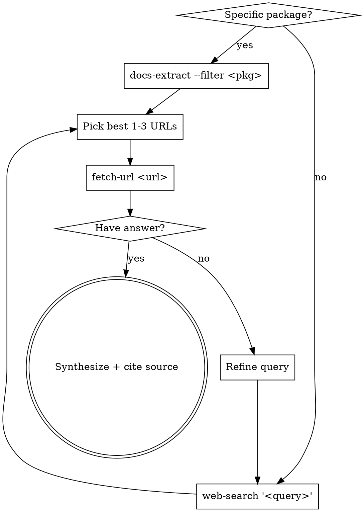

# Web Research

## When to Use

- The codebase references a library, framework, or API and you don't
  remember the exact signature / behavior at this version.
- An error message is unfamiliar and might match a known issue.
- The user asks about something released after your training cutoff.
- You're about to make a confident claim about an external system —
  pause and verify.

**Don't use** for things in the repo (use `find-symbol` / Grep instead)
or for general programming knowledge you already know.

## The Tools

| Step | Tool | Purpose |
|------|------|---------|
| 1 | `web-search` | Find candidate URLs |
| 2 | `fetch-url` | Read a specific page as clean markdown |
| 3 | `docs-extract` | Jump straight to a dependency's homepage/repo |

All three live under `packages/opencode/script/agent-tools/`. Run them
with `bun <tool>.ts <args>`.

## The Workflow



## Query Tips

- **Quote exact strings**: error messages and API names go in quotes.
  Bare keyword search drowns in tutorials.
- **Add the version**: `react useEffect cleanup React 19` beats just
  `react useEffect cleanup` when the API has shifted.
- **Use site filters**:
  - `--site=github.com` for known issues / source
  - `--site=stackoverflow.com` for "I just want a working example"
  - `--site=docs.<framework>.dev` for canonical docs
- **Search the symptom, not the diagnosis**. Paste the literal error
  string before forming a hypothesis — Stack Overflow / GitHub issues
  index by exact text.

## Source Quality (in this order)

1. **Official docs / RFCs / spec** — canonical, dated.
2. **Project's GitHub issues + PRs** — the maintainers' actual answers.
3. **Recent (≤2y) Stack Overflow with high votes** — community consensus.
4. **Engineering blogs from the project's company** — the team weighs in.
5. **Random tutorials / Medium articles** — last resort, double-check.

If sources disagree, prefer the more recent one and note the disagreement.

## Citing What You Find

When you use information from a web fetch, **always cite the URL** in
your reply. Format:

> The `useEffect` cleanup runs before the next effect _and_ on unmount
> ([React docs, useEffect](https://react.dev/reference/react/useEffect)).

This lets the user verify and prevents you from hallucinating with
plausible-sounding sources that don't exist.

## Backend Configuration

`web-search` picks a backend in this order:

1. **Brave Search API** — set `BRAVE_SEARCH_API_KEY`. Best quality,
   1k free queries/month, JSON output.
2. **SearXNG** — set `SEARXNG_URL` to a self-hosted instance.
   Privacy-preserving meta-search.
3. **DuckDuckGo HTML** — default, no key required. Works out of the
   box; fragile if DDG changes their HTML.

For research-heavy work, configure Brave — DDG falls over on long
sessions because of rate limits.

## Anti-patterns

| Don't | Why |
|-------|-----|
| Search before checking the codebase | Often the answer is in `find-symbol` / Grep. |
| Read 10 pages | Pick 1-3 likely best. If wrong, refine and try again. |
| Answer without citing the source | The user can't verify your claim. |
| Trust a single Stack Overflow answer with 0 votes | Aggregate or move to docs. |
| Skip the version in the query | Library APIs change; "react hooks" without "v18" is a mess. |
| Quote a search snippet as fact | Snippets are out-of-context; fetch-url to read the actual page. |

## Red Flags in Results

If web search returns:

- **Pages all from the same low-quality SEO farm** → refine query, add
  `-site:<bad-domain>` (you can chain in the query string).
- **Only paywalled / signup-required pages** → switch to `--site=github.com`
  for the project's own docs.
- **Result snippets contradict each other** → one of them is wrong; read
  the actual pages with fetch-url and prefer the dated/canonical one.

## Examples

```bash
# 1. Library API lookup
bun script/agent-tools/docs-extract.ts --filter solid-js
# → 🔗 https://github.com/solidjs/solid
bun script/agent-tools/fetch-url.ts https://docs.solidjs.com/concepts/components

# 2. Error triage
bun script/agent-tools/web-search.ts \
  '"useMenuItemContext must be used within a Menu.Item" kobalte'
# → top hit: Kobalte GitHub issue with the fix

# 3. CVE / security check (combined with dep-audit)
bun script/agent-tools/dep-audit.ts --severity=high
bun script/agent-tools/web-search.ts \
  --site=github.com 'CVE-2024-XXXXX advisory'
```
